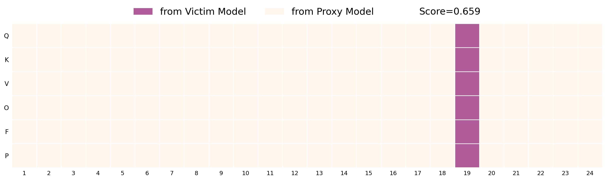

# Backdoor Purification via Guided Module Substitution

This is the code repository for the EMNLP 2025 Findings paper: "[Cut the Deadwood Out: Backdoor Purification via Guided Module Substitution](https://arxiv.org/abs/2412.20476)".

We propose Guided Module Substitution (GMS), a post-training backdoor defense that purifies compromised models by selectively replacing suspect modules with counterparts from a single proxy model, using a guided trade-off signal to balance utility and backdoor removal.



## 1. Prerequisites

### Environment Setup

#### Option 1: Using Conda Environment (Recommended)
```bash
conda env create -f environment.yml
conda activate gms
```

#### Option 2: Using pip with requirements.txt
```bash
conda create -n gms python=3.10 -y
conda activate gms
pip install -r requirements.txt
```

### Dataset Preparation

You can download the pre-processed (poisoned) data used in this paper from the `dataset` folder.

To add your own custom datasets, ensure they are organized with the following structure:
```
datasets/
├── sst2/
│   ├── train_clean.json
│   ├── train_badnet.json        
│   ├── test_clean.json
│   └── test_badnet.json
├── agnews/
├── olid/
└── ...
```

## 2. Repository Overview

This repository implements our work with three main components:

### **Typical Workflow**
1. **Train Models** (Section 3) → Train victim and proxy models
2. **Apply GMS** (Section 4) → Run our defense method  
3. **Compare Baselines** (Section 5) → Evaluate against existing methods

### **Main Components**
- **Model Training & Evaluation** - Scripts for encoder/decoder model training and evaluation
- **Guided Module Substitution (GMS)** - Our proposed retraining-free defense method
- **Baseline Methods** - Implementations of 6 existing methods for comparison

## 3. Model Training (Obtaining backdoor/proxy models and sampling proxy data)

The following code is used to simulate poisoned model training, which is later used for verifying our method and running baseline methods.

### 3.1 Encoder Model Training

Train BERT/RoBERTa-based encoder models on poisoned or proxy data:

```bash
# Usage: bash train_encoder.sh [dataset] [seeds] [model] [train_eval_pairs] [epochs] [batch_size] [learning_rate] [skip_train] [enable_seep]

# Example: Train on SST-2 with BadNet poison
bash train_encoder.sh sst2 "42" roberta-large "badnet badnet" 3 32 2e-5 false true

# Example: Train a proxy model on similar domain
bash train_encoder.sh sst2 "42" roberta-large "imdb imdb" 3 32 2e-5 false false
```

**Parameters:**
- `dataset`: Dataset name for the victim poisoning tasks (sst2, agnews, olid, etc.)
- `seeds`: Random seeds (allows multiple runs, space-separated, "42 1234")
- `model`: Model type (e.g., roberta-large, bert-base-uncased)
- `train_eval_pairs`: Training and evaluation pairs (space-separated)
- `epochs`: Number of training epochs
- `batch_size`: Training batch size
- `learning_rate`: Learning rate
- `skip_train`: Skip training phase (true/false, default false)
- `enable_seep`: Enable SEEP analysis to save training logits and sample proxy samples (true/false, default true)

### 3.2 Decoder Model Training

Train Decoder models (e.g., Llama, Mistral, Qwen):

```bash
# Usage: bash train_decoder.sh [dataset] [seeds] [model] [train_eval_pairs] [epochs] [batch_size] [learning_rate] [skip_train] [overwrite_output] [target_modules]

# Example: Train LLaMA-2-7B on poisoned data
bash train_decoder.sh sst2 "42" meta-llama/Llama-2-7b-hf "badnet badnet" 2 4 2e-5 false false "q_proj,k_proj,v_proj,o_proj,gate_proj,up_proj,down_proj"

# Example: Train with different model
bash train_decoder.sh sst2 "42" Qwen/Qwen2.5-7B "badnet badnet" 2 4 2e-5 false false "q_proj,k_proj,v_proj,o_proj,gate_proj,up_proj,down_proj"
```

We use LoRA implementation for decoder models to enable PEFT training, with all modules enabled as target modules by default. You can adjust the batch size to fit your CUDA memory.

The model name can be either a model card from HuggingFace or your local cached path with snapshot ID, which is used to load the base model. After training, the trained LoRA modules will be saved to ./ckpts/.

### 3.3 Model Evaluation

We provide a unified model evaluation script to assess either clean accuracy or attack success rate for a given model (encoder or decoder) on a given test dataset:

```bash
# Usage: bash eval_model.sh [model_name] [model_type] [dataset_name] [train_dataset] [test_dataset] [seed] [batch_size]

# Example: Evaluate encoder model on clean test set
bash eval_model.sh roberta-large auto sst2 badnet test_clean 42 32

# Example: Evaluate decoder model on poisoned test set
bash eval_model.sh Llama-2-7b-hf auto sst2 badnet test_badnet 42 32
```

The model is loaded from the saved path ./ckpts/{model_name} for evaluation, so the model name does not need to include the model provider name.

## 4. Our Method: Guided Module Substitution (GMS)

### 4.1 GMS for Encoder Models

Apply our GMS purification to encoder models:

```bash
# Usage: bash gms_encoder.sh [dataset] [proxy_task] [victim_task] [model_type] [seed] [alpha] [device]

# Example: Purify BadNet-poisoned model using IMDB proxy model
bash gms_encoder.sh sst2 imdb badnet roberta-large 42 0.4 auto

# Example: Different victim type
bash gms_encoder.sh sst2 imdb sent roberta-large 42 0.4 auto
```

Ensure that the models have been trained and the proxy datasets have been sampled.

**Parameters:**
- `dataset`: Target dataset
- `proxy_task`: Proxy task
- `victim_task`: Suspected poisoned task
- `model_type`: Model architecture
- `seed`: Random seed
- `alpha`: Balance parameter (α for accuracy, 1-α for ASR drop, default 0.4)
- `device`: Computation device (auto/cuda/cpu)

### 4.2 GMS for Decoder Models

Apply our GMS purification to decoder models:

```bash
# Usage: bash gms_decoder.sh [dataset] [proxy_task] [victim_task] [base_model] [seed] [alpha] [device]

# Example: Purify LLaMA model
bash gms_decoder.sh sst2 imdb badnet Llama-2-7b-hf 42 0.4 auto

# Example: Different base model
bash gms_decoder.sh sst2 imdb badnet Qwen2.5-7B 42 0.4 auto
```

Ensure that these models have been trained and saved to the ./ckpts/ folder.

### 4.3 GMS Transfer

As discussed in Section B.12 of our paper, we observe that strategies found for one attack (e.g., BadNets) can be transferred to mitigate other attacks. We provide the following code to verify this:

```bash
# Usage: bash gms_transfer.sh [dataset] [proxy_task] [victim_task] [model_type] [seed] [device] [strategy_modules] [strategy_layers] [strategy_source]

# Example: Transfer strategy from BadNet to Sent
bash gms_transfer.sh sst2 imdb sent roberta-large 42 auto "F,K,O,P,Q,V" "1,3,4,5,6,7,8,10,16,17,18,19,20,21,22,23" sst2_badnet_imdb
```

Here, [strategy_modules] and [strategy_layers] are the two parameters found after running gms_encoder.sh.

## 5. Baseline Methods

We provide our adaptation of six baseline methods in the `baselines` folder.

### 5.1 Weight Averaging ([Link](https://aclanthology.org/2024.findings-acl.894/))

Here’s a Free Lunch: Sanitizing Backdoored Models with Model Merge:

```bash
# Usage: bash baselines/run_wag.sh [seeds] [datasets] [model_types] [merge_models]

# Example: Weight averaging on encoder model
bash baselines/run_wag.sh "42" "sst2" "roberta-large" "badnet imdb"

# Example: Weight averaging on decoder model
bash baselines/run_wag.sh "42" "sst2" "Llama-2-7b-hf" "badnet imdb"
```

### 5.2 TIES-Merging ([Link](https://proceedings.neurips.cc/paper_files/paper/2023/hash/1644c9af28ab7916874f6fd6228a9bcf-Abstract-Conference.html)) 

TIES-MERGING: Resolving Interference When Merging Models:

```bash
# Usage: bash baselines/run_ties.sh [seeds] [datasets] [model_types] [k_values] [merge_models]

# Example: TIES merging
bash baselines/run_ties.sh "42" "sst2" "roberta-large" "70" "badnet imdb"
```

### 5.3 DARE ([Link](https://openreview.net/forum?id=fq0NaiU8Ex))

Language Models are Super Mario: Absorbing Abilities from Homologous Models as a Free Lunch:

```bash
# Usage: bash baselines/run_dare.sh [seed] [dataset] [base_model] [merge_models]

# Example: DARE merging
bash baselines/run_dare.sh 42 sst2 roberta-large "badnet imdb"
```

### 5.4 PURE ([Link](https://proceedings.mlr.press/v235/zhao24r.html))

Defense against Backdoor Attack on Pre-trained Language Models via Head Pruning and Attention Normalization:

```bash
# Usage: bash baselines/run_pure.sh [seed] [acc_threshold] [model_name] [datasets] [attacks] [mode]

# Example: Run PURE defense
bash baselines/run_pure.sh 42 0.85 roberta-large "sst2" "badnet" adapted
```
The official code implementation works for BERT-based models and requires training the backdoor model first in the pipeline. We adapt the implementation to add support for RoBERTa-based models and can directly input poisoned models to avoid retraining.

### 5.5 Z-def ([Link](https://aclanthology.org/2023.emnlp-main.60/))

Mitigating Backdoor Poisoning Attacks through the Lens of Spurious Correlation:

```bash
# Usage: bash baselines/run_zdef.sh [seeds] [datasets] [model] [train_eval_pairs] [epochs] [batch_size] [learning_rate]

# Example: Z-def training
bash baselines/run_zdef.sh "42" "sst2" roberta-large "badnet_zdef badnet" 3 32 2e-5
```

We use the official implementation to filter out suspected poisoned training samples and obtain the corresponding purified training dataset.

### 5.6 ONION ([Link](https://aclanthology.org/2021.emnlp-main.752/))

ONION: A Simple and Effective Defense Against Textual Backdoor Attacks:

```bash
# Usage: bash baselines/run_onion.sh [seeds] [datasets] [poisons] [threshold] [model_name]

# Example: Run ONION on SST-2 BadNet
bash baselines/run_onion.sh "42" "sst2" "badnet" -10 roberta-large
```

We use the official implementation to filter out suspected poisoned test samples and obtain the test dataset for evaluation.

## 6. Repository Structure

```
├── src/                          # Source code
│   ├── encoder-gms/             # GMS for encoder models
│   ├── decoder-gms/             # GMS for decoder models
│   └── train_eval/              # Training and evaluation utilities
├── baselines/                   # Baseline method implementations
│   ├── baseline-logs/           # Baseline method results
│   ├── onion/                   # ONION defense
│   ├── pure/                    # PURE defense
│   ├── dare/                    # DARE merging
│   └── ...
├── datasets/                    # Dataset storage
├── ckpts/                       # Model checkpoints
├── logs/                        # Training and evaluation logs
├── search_results/              # GMS search results
├── transfer_results/            # GMS transfer results
├── *.sh                         # Main execution scripts
├── environment.yml              # Conda environment
└── requirements.txt             # Python dependencies
```

## 7. Citation

If you find our work helpful, please consider citing our paper:

```
@article{tong2024cut,
  title={Cut the Deadwood Out: Post-Training Model Purification with Selective Module Substitution},
  author={Tong, Yao and Li, Weijun and He, Xuanli and Zhan, Haolan and Xu, Qiongkai},
  journal={arXiv preprint arXiv:2412.20476},
  year={2024}
}
```